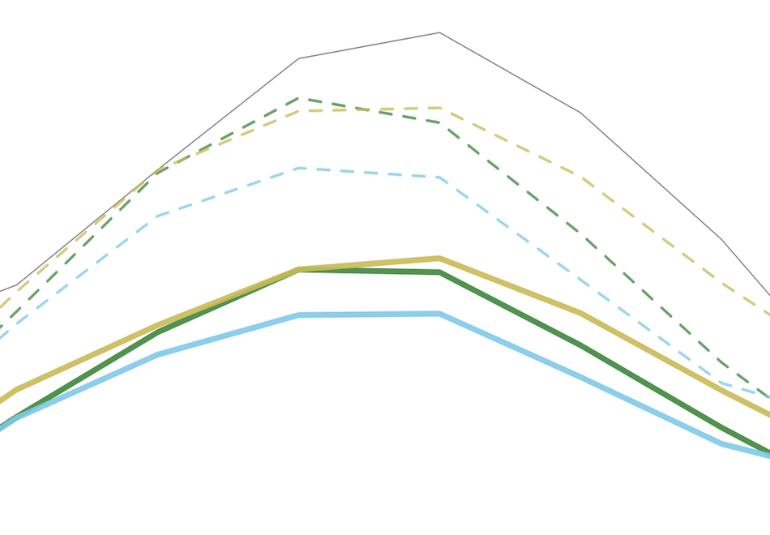

# Seasonal Forecast System (SFS)

|  <b>ENSO Index</b>             |   <b>ENSO RMSE</b>    |
| --- | --- |
| asdfd  | assdf |
|    Github: [ens_means](https://github.com/tariqhamzeygmu/ufs_model_evaluation/blob/develop/notebooks/enso-index-ens_means.ipynb), [baseline](https://github.com/tariqhamzeygmu/ufs_model_evaluation/blob/develop/notebooks/enso-index-baseline.ipynb), [beta.0.1](https://github.com/tariqhamzeygmu/ufs_model_evaluation/blob/develop/notebooks/enso-index-beta.0.1.ipynb),  [c96_beta.0.1](https://github.com/tariqhamzeygmu/ufs_model_evaluation/blob/develop/notebooks/enso-index-c96_beta.0.1.ipynb), [cpc_ics](https://github.com/tariqhamzeygmu/ufs_model_evaluation/blob/develop/notebooks/enso-index-cpc_ics.ipynb)  Binder:   Colab:|   Github: [rmse](https://github.com/tariqhamzeygmu/ufs_model_evaluation/blob/develop/notebooks/enso-rmse.ipynb)  Binder:   Colab: |
