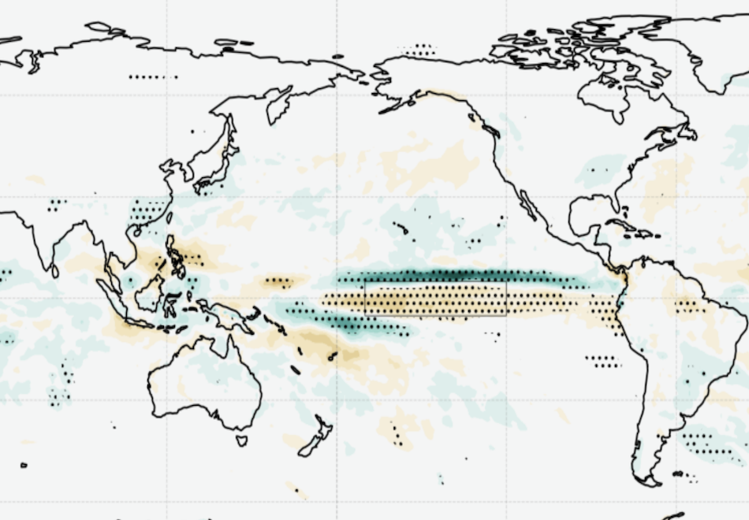
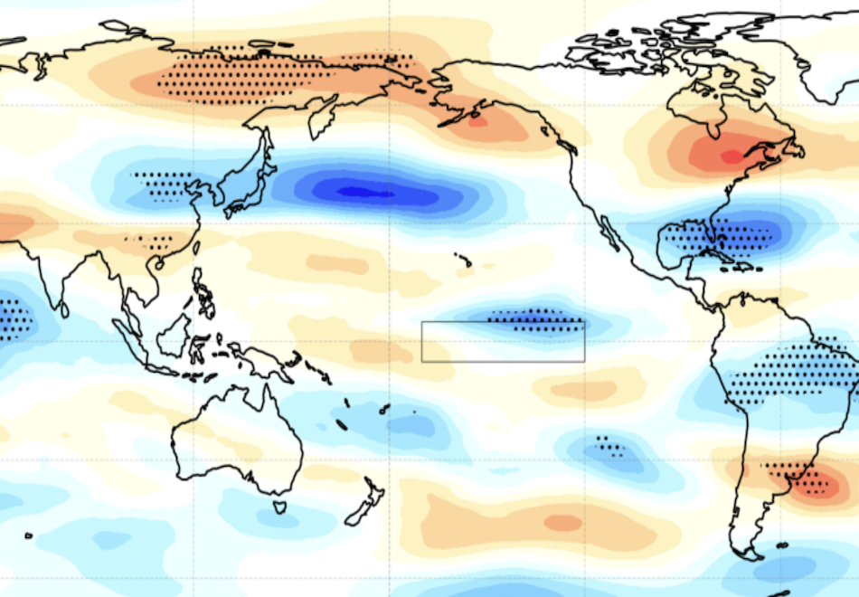
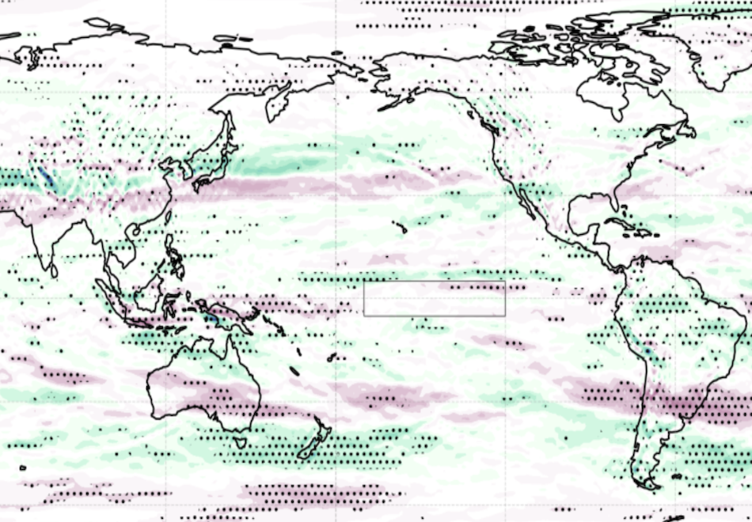

  
ENSO Analysis

|  <b>ENSO Index</b>             |   <b>ENSO RMSE</b>    |
| :--- | :--- |
|   Github: [ens_means](https://github.com/tariqhamzeygmu/ufs_model_evaluation/blob/develop/notebooks/enso-index-ens_means.ipynb), [baseline](https://github.com/tariqhamzeygmu/ufs_model_evaluation/blob/develop/notebooks/enso-index-baseline.ipynb), [beta.0.1](https://github.com/tariqhamzeygmu/ufs_model_evaluation/blob/develop/notebooks/enso-index-beta.0.1.ipynb),  [c96_beta.0.1](https://github.com/tariqhamzeygmu/ufs_model_evaluation/blob/develop/notebooks/enso-index-c96_beta.0.1.ipynb), [cpc_ics](https://github.com/tariqhamzeygmu/ufs_model_evaluation/blob/develop/notebooks/enso-index-cpc_ics.ipynb)  Binder: [ens_means](https://mybinder.org/v2/gh/tariqhamzeygmu/ufs_model_evaluation_public/94d22d027d86153a0286a4e803efa887346c4b1c?urlpath=lab%2Ftree%2Fnotebooks%2Fenso-index-ens_means.ipynb), [baseline](https://mybinder.org/v2/gh/tariqhamzeygmu/ufs_model_evaluation_public/94d22d027d86153a0286a4e803efa887346c4b1c?urlpath=lab%2Ftree%2Fnotebooks%2Fenso-index-baseline.ipynb), [beta.0.1](https://mybinder.org/v2/gh/tariqhamzeygmu/ufs_model_evaluation_public/94d22d027d86153a0286a4e803efa887346c4b1c?urlpath=lab%2Ftree%2Fnotebooks%2Fenso-index-beta.0.1.ipynb),  [c96_beta.0.1](https://mybinder.org/v2/gh/tariqhamzeygmu/ufs_model_evaluation_public/94d22d027d86153a0286a4e803efa887346c4b1c?urlpath=lab%2Ftree%2Fnotebooks%2Fenso-index-c96_beta.0.1.ipynb), [cpc_ics](https://mybinder.org/v2/gh/tariqhamzeygmu/ufs_model_evaluation_public/94d22d027d86153a0286a4e803efa887346c4b1c?urlpath=lab%2Ftree%2Fnotebooks%2Fenso-index-cpc_ics.ipynb)  Colab: [ens_means](https://colab.research.google.com/github/tariqhamzeygmu/ufs_model_evaluation/blob/develop/notebooks/enso-index-ens_means.ipynb), [baseline](https://colab.research.google.com/github/tariqhamzeygmu/ufs_model_evaluation/blob/develop/notebooks/enso-index-baseline.ipynb), [beta.0.1](https://colab.research.google.com/github/tariqhamzeygmu/ufs_model_evaluation/blob/develop/notebooks/enso-index-beta.0.1.ipynb),  [c96_beta.0.1](https://colab.research.google.com/github/tariqhamzeygmu/ufs_model_evaluation/blob/develop/notebooks/enso-index-c96_beta.0.1.ipynb), [cpc_ics](https://colab.research.google.com/github/tariqhamzeygmu/ufs_model_evaluation/blob/develop/notebooks/enso-index-cpc_ics.ipynb) |    Github: [rmse](https://github.com/tariqhamzeygmu/ufs_model_evaluation/blob/develop/notebooks/enso-rmse.ipynb)   Binder: [rmse](https://mybinder.org/v2/gh/tariqhamzeygmu/ufs_model_evaluation_public/94d22d027d86153a0286a4e803efa887346c4b1c?urlpath=lab%2Ftree%2Fnotebooks%2Fenso-rmse.ipynb)   Colab: |
|  <b>Teleconnections Precip</b>             |   <b>Teleconnections Wind</b>    |
|   Github: [UFSvsUFS](https://github.com/tariqhamzeygmu/ufs_model_evaluation/blob/develop/notebooks/enso-teleconnections-precip-UFSvsUFS.ipynb), [baseline](https://github.com/tariqhamzeygmu/ufs_model_evaluation/blob/develop/notebooks/enso-teleconnections-precip-baseline.ipynb), [beta.0.1](https://github.com/tariqhamzeygmu/ufs_model_evaluation/blob/develop/notebooks/enso-teleconnections-precip-beta.0.1.ipynb),  [c96_beta.0.1](https://github.com/tariqhamzeygmu/ufs_model_evaluation/blob/develop/notebooks/enso-teleconnections-precip-c96_beta.0.1.ipynb), [cpc_ics](https://github.com/tariqhamzeygmu/ufs_model_evaluation/blob/develop/notebooks/enso-teleconnections-precip-cpc_ics.ipynb)  Binder: [UFSvsUFS](https://mybinder.org/v2/gh/tariqhamzeygmu/ufs_model_evaluation_public/94d22d027d86153a0286a4e803efa887346c4b1c?urlpath=lab%2Ftree%2Fnotebooks%2Fenso-teleconnections-precip-UFSvsUFS.ipynb), [baseline](https://mybinder.org/v2/gh/tariqhamzeygmu/ufs_model_evaluation_public/94d22d027d86153a0286a4e803efa887346c4b1c?urlpath=lab%2Ftree%2Fnotebooks%2Fenso-teleconnections-precip-baseline.ipynb), [beta.0.1](https://mybinder.org/v2/gh/tariqhamzeygmu/ufs_model_evaluation_public/94d22d027d86153a0286a4e803efa887346c4b1c?urlpath=lab%2Ftree%2Fnotebooks%2Fenso-teleconnections-precip-beta.0.1.ipynb),  [c96_beta.0.1](https://mybinder.org/v2/gh/tariqhamzeygmu/ufs_model_evaluation_public/94d22d027d86153a0286a4e803efa887346c4b1c?urlpath=lab%2Ftree%2Fnotebooks%2Fenso-teleconnections-precip-c96_beta.0.1.ipynb), [cpc_ics](https://mybinder.org/v2/gh/tariqhamzeygmu/ufs_model_evaluation_public/94d22d027d86153a0286a4e803efa887346c4b1c?urlpath=lab%2Ftree%2Fnotebooks%2Fenso-teleconnections-precip-cpc_ics.ipynb)  Colab: |   Github: [UFSvsUFS](https://github.com/tariqhamzeygmu/ufs_model_evaluation/blob/develop/notebooks/enso-teleconnections-wind-UFSvsUFS.ipynb), [baseline](https://github.com/tariqhamzeygmu/ufs_model_evaluation/blob/develop/notebooks/enso-teleconnections-wind-baseline.ipynb), [beta.0.1](https://github.com/tariqhamzeygmu/ufs_model_evaluation/blob/develop/notebooks/enso-teleconnections-wind-beta.0.1.ipynb),  [c96_beta.0.1](https://github.com/tariqhamzeygmu/ufs_model_evaluation/blob/develop/notebooks/enso-teleconnections-wind-c96_beta.0.1.ipynb), [cpc_ics](https://github.com/tariqhamzeygmu/ufs_model_evaluation/blob/develop/notebooks/enso-teleconnections-wind-cpc_ics.ipynb)  Binder: [UFSvsUFS](https://mybinder.org/v2/gh/tariqhamzeygmu/ufs_model_evaluation_public/94d22d027d86153a0286a4e803efa887346c4b1c?urlpath=lab%2Ftree%2Fnotebooks%2Fenso-teleconnections-wind-UFSvsUFS.ipynb), [baseline](https://mybinder.org/v2/gh/tariqhamzeygmu/ufs_model_evaluation_public/94d22d027d86153a0286a4e803efa887346c4b1c?urlpath=lab%2Ftree%2Fnotebooks%2Fenso-teleconnections-wind-baseline.ipynb), [beta.0.1](https://mybinder.org/v2/gh/tariqhamzeygmu/ufs_model_evaluation_public/94d22d027d86153a0286a4e803efa887346c4b1c?urlpath=lab%2Ftree%2Fnotebooks%2Fenso-teleconnections-wind-beta.0.1.ipynb),  [c96_beta.0.1](https://mybinder.org/v2/gh/tariqhamzeygmu/ufs_model_evaluation_public/94d22d027d86153a0286a4e803efa887346c4b1c?urlpath=lab%2Ftree%2Fnotebooks%2Fenso-teleconnections-wind-c96_beta.0.1.ipynb), [cpc_ics](https://mybinder.org/v2/gh/tariqhamzeygmu/ufs_model_evaluation_public/94d22d027d86153a0286a4e803efa887346c4b1c?urlpath=lab%2Ftree%2Fnotebooks%2Fenso-teleconnections-wind-cpc_ics.ipynb)  Colab: |
|  <b>Teleconnections Rossby Wave Source</b>             |  |
|   Github: [UFSvsUFS](https://github.com/tariqhamzeygmu/ufs_model_evaluation/blob/develop/notebooks/enso-teleconnections-rws-UFSvsUFS.ipynb), [baseline](https://github.com/tariqhamzeygmu/ufs_model_evaluation/blob/develop/notebooks/enso-teleconnections-rws-baseline.ipynb), [beta.0.1](https://github.com/tariqhamzeygmu/ufs_model_evaluation/blob/develop/notebooks/enso-teleconnections-rws-beta.0.1.ipynb),  [c96_beta.0.1](https://github.com/tariqhamzeygmu/ufs_model_evaluation/blob/develop/notebooks/enso-teleconnections-rws-c96_beta.0.1.ipynb), [cpc_ics](https://github.com/tariqhamzeygmu/ufs_model_evaluation/blob/develop/notebooks/enso-teleconnections-rws-cpc_ics.ipynb)  Binder: [UFSvsUFS](https://mybinder.org/v2/gh/tariqhamzeygmu/ufs_model_evaluation_public/94d22d027d86153a0286a4e803efa887346c4b1c?urlpath=lab%2Ftree%2Fnotebooks%2Fenso-teleconnections-rws-UFSvsUFS.ipynb), [baseline](https://mybinder.org/v2/gh/tariqhamzeygmu/ufs_model_evaluation_public/94d22d027d86153a0286a4e803efa887346c4b1c?urlpath=lab%2Ftree%2Fnotebooks%2Fenso-teleconnections-rws-baseline.ipynb), [beta.0.1](https://mybinder.org/v2/gh/tariqhamzeygmu/ufs_model_evaluation_public/94d22d027d86153a0286a4e803efa887346c4b1c?urlpath=lab%2Ftree%2Fnotebooks%2Fenso-teleconnections-rws-beta.0.1.ipynb),  [c96_beta.0.1](https://mybinder.org/v2/gh/tariqhamzeygmu/ufs_model_evaluation_public/94d22d027d86153a0286a4e803efa887346c4b1c?urlpath=lab%2Ftree%2Fnotebooks%2Fenso-teleconnections-rws-c96_beta.0.1.ipynb), [cpc_ics](https://mybinder.org/v2/gh/tariqhamzeygmu/ufs_model_evaluation_public/94d22d027d86153a0286a4e803efa887346c4b1c?urlpath=lab%2Ftree%2Fnotebooks%2Fenso-teleconnections-rws-cpc_ics.ipynb)  Colab: |  |

  
NAO Analysis

  
PNA Analysis

